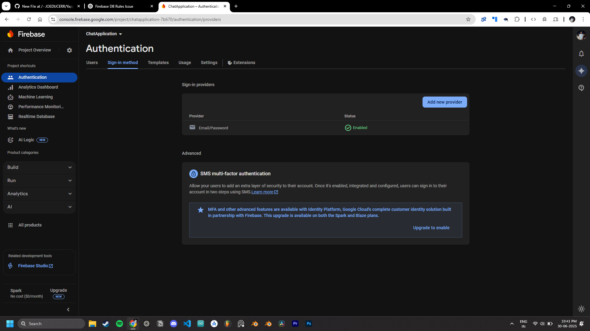
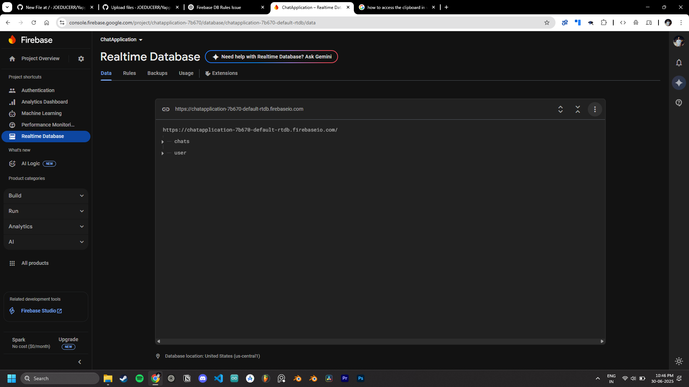
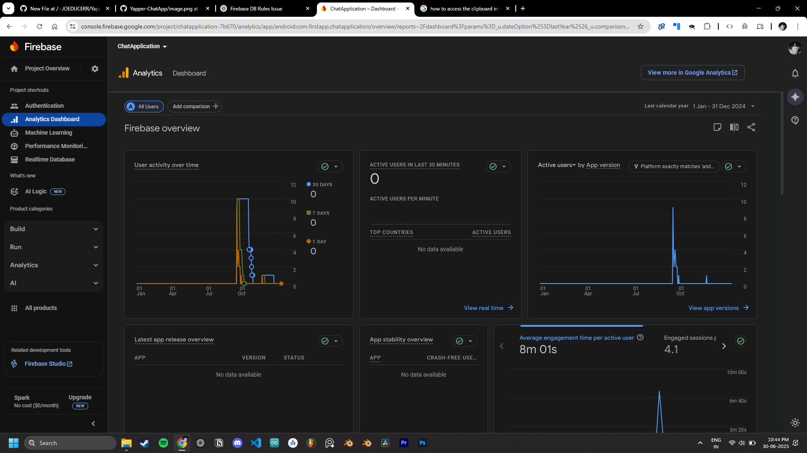
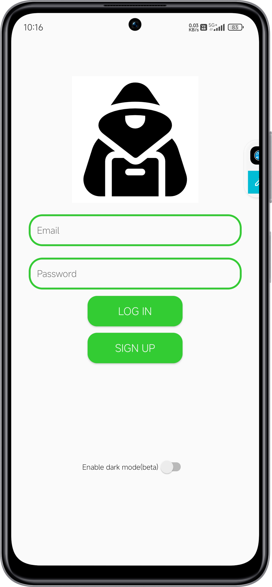
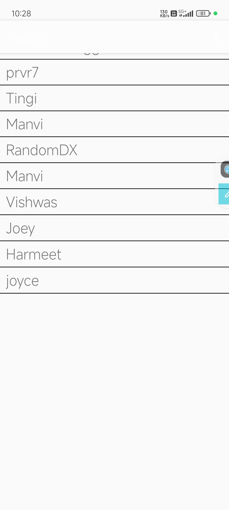
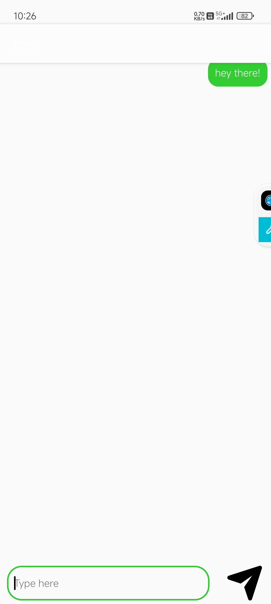

# Yapper – Chat Application

Yapper is a clean and modern Android chat application that enables real-time messaging between users. It includes a secure login and signup flow, a user list to initiate chats, and seamless integration with Firebase for authentication, data storage, and analytics.

🚀 Features
* User Authentication (Login / Sign Up using Firebase Auth)
* Real-Time Chat (Firebase Realtime Database)
* User List – Start chatting instantly with anyone registered
* Firebase Analytics – Monitor app performance and user behavior
* UI Screenshots Included (Authentication, Chat, and more)

### 🔐 Firebase Authentication

### 💾 Firebase Realtime Database

### 📈 Firebase Analytics

---

### 📱 App Screens

#### Login Screen

#### User List

#### Chat Screen

| Technology             | Purpose                                   |
| ---------------------- | ----------------------------------------- |
| **Kotlin**             | Android app development                   |
| **Firebase Auth**      | User authentication                       |
| **Realtime Database**  | Storing and syncing messages in real time |
| **Firebase Analytics** | App usage and event tracking              |
